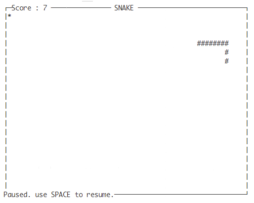

# snakai 有AI的贪吃蛇


snake is running! our project final goal is to build a snake game driven by Reinforcement Learning.

贪吃蛇出动！远期目标是实现强化学习驱动的贪吃蛇游戏。

## Setting / 设置

language: Python3

package-name: snakai (snake + ai)

## Start / 开始

```bash
# create env and active it
python -m venv snakai_env
source snakai_env/bin/activate
# install 
pip install snakai
# pip install -e . # in dev mode
run_snake # use -h to see comand options
```

you will see following screen if no exception.



## Progress / 进度

[x] draw snake based on curses. 绘制贪吃蛇（控制台） [DONE]

    从 https://gist.github.com/sanchitgangwar/2158089 下载了一个示例，照着学习。

[] rule-based strategy. 基于规则的AI [TODO]

[] RL-based strategy. 基于强化学习的AI [TODO] 
        
[] unity or some other game-engine driven snake? 基于其他游戏引擎的贪吃蛇？ [TODO]


## 日志

- 2019.12.28: 有空重新组织了代码结构，完成了绘制逻辑和状态逻辑的拆分；写了snake游戏的开发关键
- 2021.01.03: 再次重新组织代码结构，完成了策略逻辑和绘制逻辑的拆分