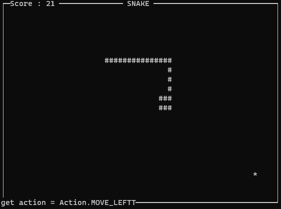

# snakai 有AI的贪吃蛇


snake is running! our project final goal is to build a snake game driven by Reinforcement Learning.

贪吃蛇出动！远期目标是实现强化学习驱动的贪吃蛇游戏。

## Setting / 设置

language: Python3

package-name: snakai (snake + ai)

## Start / 开始

```bash
# create env and active it
python -m venv snakai_env
source snakai_env/bin/activate
# install 
pip install snakai
# or `pip install -e .` in dev mode
# run snake using QLearning based strategy.
run_snake -s qlearning 
# `run_snake -s rule_based` to run in rule-based strategy, or `-s manual` to playing the game...
# `run_snake -h` to see all params
```

> Attention: if you want to run `qlearning` based strategy, you need train it firstly.  
  Just go to [qlearning-strategy](snakai/strategy/qlearning) and run the `scripts'` script to train the model.  
  Currently, about 13 minutes is needed.

you will see following screen if no exception.



> screen by the fantastic [ScreenToGif](https://github.com/NickeManarin/ScreenToGif)


## Progress / 进度

- [x] draw snake based on curses. 绘制贪吃蛇（控制台） ✅✅✅

    从 https://gist.github.com/sanchitgangwar/2158089 下载了一个示例，照着学习。

    - 完成 package 构建 ＆ 配置上传到 pypi

- [x] rule-based strategy. 基于规则的AI ✅🔲🔲

    - 完成一个基于规则的策略。目前看比较笨。之前调研的时候发现有用 `哈密顿连通图` 之类来做，后续可以试下。
    - 另外，还准备试下 `A*` 算法，之前说好要在博客介绍一下 A* 算法的

- [x] RL-based strategy. 基于强化学习的AI [little milestone] ✅🔲🔲

    - 目前做了基于 `Q-Learning` 的策略。具体见 [qlearning-strategy](snakai/strategy/qlearning).
    - 后续准备优化 & 尝试 Deep Q-Learning
        
- [ ] unity or some other game-engine driven snake? 基于其他游戏引擎的贪吃蛇？ 🔲🔲🔲


## 日志

[roadmap](ROADMAP.md)

- 2021.08.08: 完成 qlearning 的基础版本。到此，最基础的策略都已经实现了！
- 2021.01.03: 再次重新组织代码结构，完成了策略逻辑和绘制逻辑的拆分
- 2019.12.28: 有空重新组织了代码结构，完成了绘制逻辑和状态逻辑的拆分；写了snake游戏的开发关键
