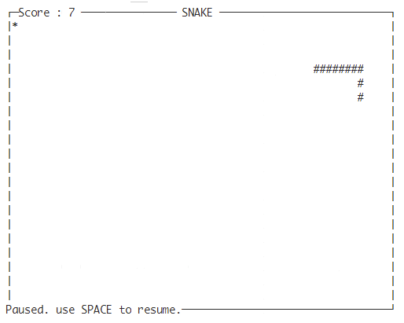

# SNAKE Game

> [中文介绍](README_CN.md)

The game rewrited based on https://gist.github.com/sanchitgangwar/2158089 . 

We split the 
drawing logic and game inner state, so that it can be easily migrated to any other UI system. 
What's more, it the first step to make a snake-ai -> in trainning, we just need the game state, while
the GUI became a burden.

## Game Screenshot



## Run

```
python3 run_curses_based_game.py
```

## Files

```bash
---
  | - snake_game_state.py 
  | - run_curses_based_game.py : a runable game based on Curses
```
